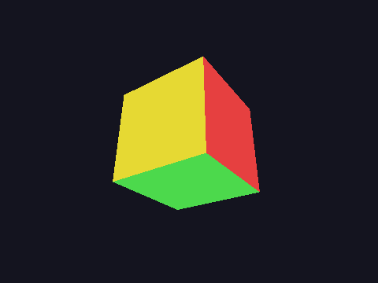

<p align="center">
  <picture>
    <source media="(prefers-color-scheme: dark)" srcset="misc/logo/icon-white.svg">
    
  </picture>
</p>

<h2 align="center">2D and 3D game engine built in Rust</h2>

<p align="center">
  <strong>
    An open-source game engine built from first principles, with extensibility at its core.
  </strong>
</p>

<p align="center">
  <a href="LICENSE"></a>
  <a href=".github/workflows/ci.yml"></a>
  <a href="rust-toolchain.toml"></a>
  <a href="https://app.codspeed.io/HylightGames/canary?utm_source=badge"></a>
  <a href="docs/roadmap/status.md"></a>
</p>

> **Early development:** Canary is currently at `v0.0.10` and is not yet
> production-ready. The engine foundation and extensibility systems are under
> active development.

## Current status

Implemented:

- Archetype-based ECS, with multi-component queries, typed resources, and change detection
- A stage-based scheduler that runs non-conflicting systems concurrently
- `Transform`/`GlobalTransform` hierarchy with scheduler-driven propagation
- ECS-driven rendering: scene extraction + CPU bake + draw through the RHI
- Native C-ABI plugins
- Sandboxed WebAssembly Component plugins
- Real windowing (behind an opt-in feature) and a first rendering backend (Vulkan)
- Fluent-backed localization
- Core runtime and platform abstractions

A full renderer (materials, lighting, post-processing), UI, physics, audio,
networking, and project state/the editor are still in development or planned.

See [`docs/roadmap/status.md`](docs/roadmap/status.md) for the complete,
living implementation status.

## Visual progress

The rendering bootstrap (`v0.0.6`): a real Vulkan pipeline, rendering
and reading back real pixels, offscreen. No swapchain/window
presentation yet — see
[`examples/spinning-cube`](examples/spinning-cube) for how this was
made and what it does and doesn't demonstrate about the RHI's current
scope.

<p align="center">
  
</p>

## Getting started

There are no binary releases yet. Build Canary from source:

```sh
git clone https://github.com/HylightGames/canary.git
cd canary

cargo build --workspace
cargo test --workspace
cargo clippy --workspace --all-targets -- -D warnings
cargo fmt --all -- --check
cargo run -p canary-runtime
```

Performance is measured in-repo too: each benchmarked crate carries a
`divan` suite under `benches/`, run on every pull request by CodSpeed —
see [`docs/development/benchmarking.md`](docs/development/benchmarking.md).

`canary-runtime` is a headless boot harness (no window yet) that exercises
the engine vertical slice end to end; see
[`docs/roadmap/status.md`](docs/roadmap/status.md) for what is and isn't
wired up.