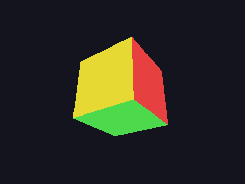

<p align="center">
  <picture>
    <source media="(prefers-color-scheme: dark)" srcset="misc/logo/icon-white.svg">
    
  </picture>
</p>

<h1 align="center">Canary Engine</h1>

<p align="center">
  <a href="https://github.com/HylightGames/canary/actions/workflows/ci.yml"></a>
  <a href="LICENSE"></a>
  <a href="https://www.rust-lang.org/"></a>
  <a href="https://github.com/HylightGames/canary/actions/workflows/codspeed.yml"></a>
</p>

Canary is a 2D and 3D game engine written in Rust. It is still being built: the project has working engine systems and a small windowed game example, but it is not ready for production games. There is no editor or downloadable build yet.

<p align="center">
  <a href="examples/spinning-cube">
    
  </a>
</p>

<p align="center"><em>An early offscreen rendering example. See the <a href="examples">examples</a> for runnable projects.</em></p>

## Project status

The current development line has a windowed sample with Vulkan rendering, keyboard controls, and an interactive HUD. Canary also has an entity-component system, a parallel system scheduler, 2D physics, audio, asset loading, localization, and native and WebAssembly plugin support.

Development happens on `dev`. The status page tracks the current milestone, completed work, and what comes next.

- [Current status](docs/roadmap/status.md)
- [Roadmap handoff](docs/roadmap/README.md)
- [Plan through v0.1.0](docs/roadmap/v0.1.0-plan.md)

## Build from source

You need the stable Rust toolchain. Canary's [`rust-toolchain.toml`](rust-toolchain.toml) selects it when you use rustup.

```sh
git clone https://github.com/HylightGames/canary.git
cd canary
cargo build --workspace
cargo test --workspace
```

To run the windowed sample, use a desktop display and a Vulkan driver:

```sh
cargo run -p ui-game -- 600
```

The `600` limits the run to 600 frames. Build and platform requirements are in the [build guide](docs/development/build-system.md). See the [sample notes](examples/ui-game/README.md) for controls and known limits.

## Documentation

- [Engine architecture](docs/architecture/engine-overview.md)
- [Examples](examples)
- [Roadmap](docs/roadmap)
- [Architecture decisions](docs/decisions/architecture-decision-records)

## Contributing

Bug reports and feature requests can be filed in [GitHub Issues](https://github.com/HylightGames/canary/issues). Before starting a large change, read the [contribution guide](CONTRIBUTING.md); it explains the project's review and development process.

For security problems, follow the private reporting instructions in [SECURITY.md](SECURITY.md) instead of opening a public issue.

Canary is released under the [MIT License](LICENSE).
