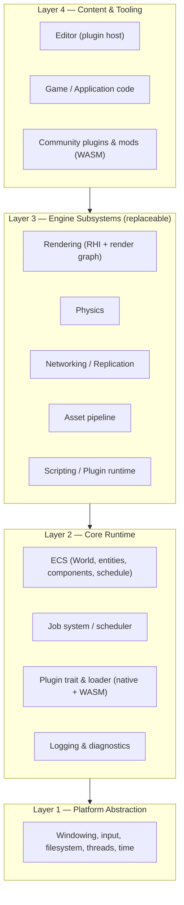
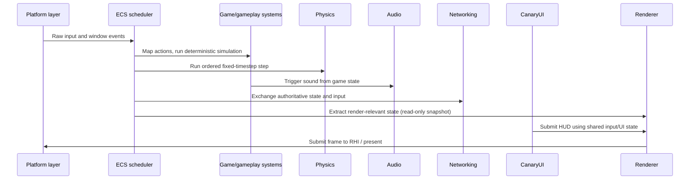

# Engine Architecture Overview

This document is the map. Each subsystem below has its own detailed document;
this one exists so a new contributor (or a future development session) can
see how the pieces fit before diving into any one of them.

## Layering

Canary is organized into four layers, each depending only on the layer below
it:

The rule that keeps this from rotting: **nothing in a lower layer may depend
on a higher layer.** The ECS does not know that a renderer exists; the
platform layer does not know that an ECS exists. Subsystems in Layer 3 talk
to each other, when they must, through the ECS (shared components/resources)
or through explicit, documented interfaces — never through ad hoc globals.

## Subsystem map

| Subsystem | Crate (current or planned) | Document |
|---|---|---|
| Platform abstraction | `canary-platform` | [platform-abstraction.md](platform-abstraction.md) |
| Core runtime (App, logging, error conventions) | `canary-core` | [core-runtime.md](core-runtime.md) |
| Game runtime composition | `canary-runtime` is currently a private headless harness; reusable consumer API planned | [core-runtime.md](core-runtime.md#the-appengine-bootstrap) |
| ECS | `canary-ecs` | [core-runtime.md](core-runtime.md) |
| Scheduler (stage-based system execution) | `canary-scheduler` | [execution-model.md](execution-model.md) |
| Input and simulation boundary | `canary-platform` raw input exists; runtime/gameplay action flow is planned | [input-and-simulation.md](input-and-simulation.md) |
| Transform & hierarchy | `canary-transform` | [transform.md](transform.md) |
| Plugin trait & loader | `canary-plugin-api` | [plugin-system.md](plugin-system.md) |
| Scripting / language-agnostic runtime | *(planned: `canary-script`)* | [scripting-system.md](scripting-system.md) |
| Rendering (RHI + Vulkan backend + ECS bridge) | `canary-render`, `canary-render-vulkan`, `canary-render-ecs` | [rendering.md](rendering.md) |
| Physics | `canary-physics` (2D slice) | [physics.md](physics.md) |
| Networking | *(planned: `canary-net`)* | [networking.md](networking.md) |
| Asset pipeline | `canary-assets` (minimal synchronous loaders) | [asset-system.md](asset-system.md) |
| UI toolkit (`CanaryUI`) | *(planned: `canary-ui-core`)* | [ui-toolkit.md](ui-toolkit.md) |
| Audio (`CanaryAudio`) | `canary-audio` (bootstrap) | [audio.md](audio.md) |
| Localization (`CanaryLoc`) | `canary-loc` | [localization.md](localization.md) |
| Project state & versioning | *(planned: `canary-state`)* | [state-and-versioning.md](state-and-versioning.md) |

"Planned" crates are architected in this document set but not implemented
yet. Some implemented crates provide only a narrow bootstrap slice; see
[`docs/roadmap/status.md`](../roadmap/status.md) for current scope.

The input and simulation document records the accepted RawInput →
InputMapping → InputAction → PlayerInput → SimulationInput boundary and
separates it from the current platform input stubs. That flow is an
acceptance prerequisite for shared UI/gameplay input and deterministic
simulation work; it is not yet an end-to-end implementation. It is part of
the next `v0.0.13` milestone.

## The two structural bets this engine makes

Everything above follows fairly conventional data-oriented engine design.
Two decisions are where Canary actually differs from precedent, and both are
load-bearing enough that the rest of the architecture assumes them:

1. **A two-tier plugin/extension model** — a sandboxed, language-agnostic
   WebAssembly Component tier for mods and marketplace content, and a
   trusted, native C-ABI tier for performance-critical subsystem
   replacement. See [plugin-system.md](plugin-system.md) and
   [ADR 0003](../decisions/architecture-decision-records/0003-plugin-and-modding-architecture.md).
2. **Everything replaceable is a trait, not a `#[cfg]` flag.** Rendering,
   physics, and asset importers are defined as interfaces in Layer 3 with a
   default implementation, so a different implementation is a new crate, not
   a fork. See [ADR 0016](../decisions/architecture-decision-records/0016-native-rendering-backends.md)
   for the RHI with native per-API backends, and the subsystem architecture
   documents for their respective boundaries.

## Threading model, in one paragraph

The current scheduler is a stage-based `Schedule` (`canary-scheduler`,
since `v0.0.8`): compatible read-only systems can run concurrently, and
every writer runs alone in registration order. Access declarations are manual
metadata and are not checked against closure access; keep the solo-writer
policy until access can be enforced (R-24). A persistent job-stealing pool,
concurrent disjoint writes, and reusable `App`-level game composition remain
future work; measure game-shaped workloads before selecting a pool design.
See [ADR discussion in core-runtime.md](core-runtime.md#threading--the-job-system).

## Target frame flow

The input/action path, window presentation, and reusable consumer composition
are not implemented yet; `.13` is planned to prove them. Network and UI stages
are optional until their corresponding subsystems are built. The sequence
below describes the target integration order, not the current runtime.

The "extract" step (ECS → Renderer) is deliberately a read-only snapshot
rather than the renderer querying live ECS state mid-frame — this is the same
pattern used by several modern data-oriented engines (see
[`docs/research/engine-comparisons.md`](../research/engine-comparisons.md))
and it's what allows rendering to run one frame behind simulation on a
separate thread later, without a redesign.

## What this document deliberately doesn't cover

Build tooling lives in [`docs/development/build-system.md`](../development/build-system.md);
repository layout in [`docs/development/repository-structure.md`](../development/repository-structure.md);
editor UI in [`docs/ui/`](../ui/). This document is the *engine* map, not the
project map.
