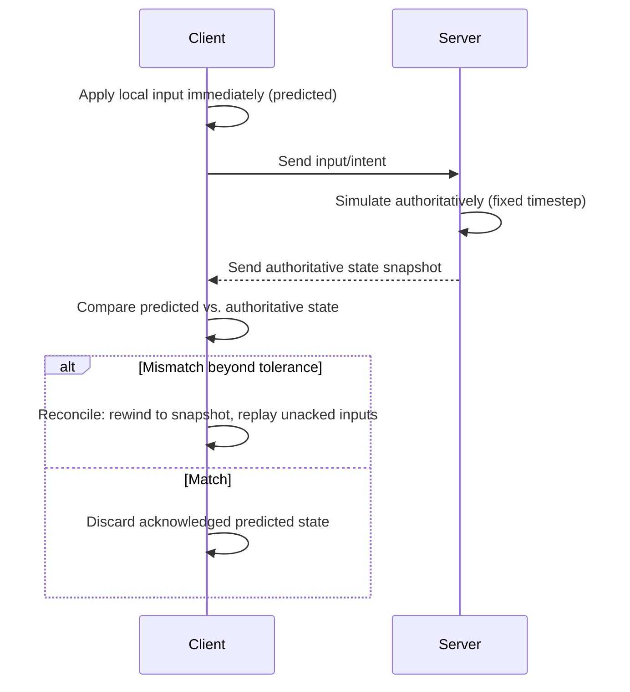

# Networking & Multiplayer

Architecture for the planned networking subsystem (see
[`docs/vision/long-term-roadmap.md`](../vision/long-term-roadmap.md)). No
`canary-net` or transport implementation exists yet. This is one of the
areas where [`docs/research/engine-comparisons.md`](../research/engine-comparisons.md)
most directly informed the design: retrofitting multiplayer onto an engine
whose ECS and simulation loop weren't designed with replication in mind is
one of the most consistently painful experiences in game development, so
several of the decisions below are seeded architecturally as early as
Era 2, well before the networking subsystem itself is built.

See [ADR 0007](../decisions/architecture-decision-records/0007-networking-and-multiplayer-model.md)
for the decision record.

## Authority model: server-authoritative by default

The default model is server-authoritative: the server owns the true
simulation state; clients send inputs and intents, and may write their own
predicted replica, but cannot commit authoritative state without authority.
They render that local prediction pending server confirmation. This is the
standard model for competitive and cheat-resistant multiplayer (and the
model most existing engines' official
networking add-ons converge on), and it composes cleanly with a
fixed-timestep, ECS-driven simulation (see [physics.md](physics.md)).

Peer-to-peer and listen-server topologies (one player's client also acts as
host) are supported as a *deployment* choice layered on the same
authority model — "the server" doesn't have to mean a dedicated data-center
process, just a process that's authoritative.

## Client prediction & reconciliation

Client-side prediction hides latency for the local player; reconciliation
corrects drift when the server's authoritative outcome disagrees with the
client's local guess. This requires the simulation to be re-runnable
("rewind and replay inputs") which is another reason the ECS's system data-
access declarations (see
[core-runtime.md](core-runtime.md#ecs-architecture)) matter early: a
scheduler that already knows which systems read/write which state is much
closer to being able to snapshot and re-simulate a slice of frames than one
that doesn't.

## Replication is an ECS concept, not a side channel

Components intended for network replication are marked as such
(conceptually, a `Replicated` marker or trait bound). The networking
subsystem can use ECS mutation change detection (see
[core-runtime.md](core-runtime.md#ecs-architecture)), but that alone is
not a replication log: component removal and entity destruction need
durable records, while snapshots and wire output need canonical ordering.
The authority model also distinguishes server-owned truth from client
predicted state; a client may simulate a local prediction but cannot commit
authoritative state without authority (ADR 0021 Amendment 3). These
contracts shape future delta/full-state transport without prescribing the
wire mechanism here.

## Transport: QUIC as the default

**Default transport: QUIC**, via the `quinn` crate — a mature, widely used
(tens of millions of downloads), pure-Rust, async QUIC implementation.
Rationale:

- QUIC natively multiplexes independent streams without head-of-line
  blocking across them, which maps well onto "some game state is reliable
  (inventory changes), some is unreliable-but-frequent (position updates)"
  without hand-rolling that distinction over raw UDP.
- Built-in TLS 1.3 encryption by default, rather than optional/bolted-on
  encryption.
- A pure-Rust implementation keeps the transport layer dependency-simple and
  consistent with the rest of the core (see
  [ADR 0002](../decisions/architecture-decision-records/0002-primary-language-selection.md)).

Raw UDP remains available underneath for subsystems that want unreliable,
unordered, unencrypted datagrams directly (e.g., very latency-sensitive
position updates where an application-level protocol on top of UDP is
preferred to QUIC's stream model) — the transport is a trait boundary like
rendering and physics, not a hard-coded dependency on `quinn` throughout the
engine.

## Rollback netcode: architected for, not required

Full rollback netcode (common in fighting games — resimulating several
frames of *every* client's local state on misprediction, not just the local
player's) is explicitly **not** a v0.0.1 or even an early-era requirement.
But because the ECS is designed around explicit system data-access
declarations and a fixed timestep from the start (see
[core-runtime.md](core-runtime.md)), adding rollback support later is
intended to be an additive capability (snapshot/restore + deterministic
re-simulation of a window of frames) rather than a rearchitecture — the same
"bootstrap for the common case, architect for the harder one" pattern used
in [rendering.md](rendering.md) for the RHI.

## Status in this foundation

Entirely architectural. No `canary-net` crate, no `quinn` dependency, and no
replication marker types exist yet — tracked explicitly in
[`docs/roadmap/v0.0.1-roadmap.md`](../roadmap/v0.0.1-roadmap.md) as later-era
work, seeded by ECS design decisions made now.
